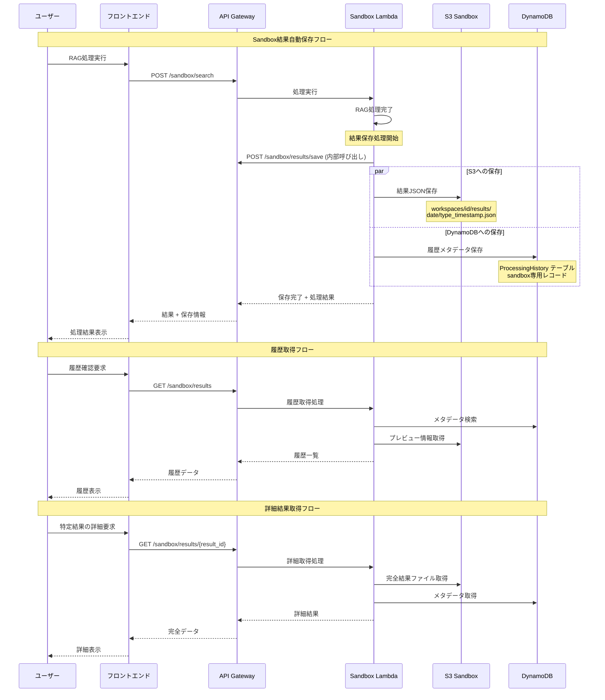

# Advanced RAGシステム API設計書

## 1. API概要

### 1.1 システム概要

- **システム名**: ソニー損保AdvancedRAGAPI
- **目的**: Advanced RAGシステムのバックエンドAPIサービスとして、文書検索、コンプライアンスチェック、約款チェック、表記チェック機能を提供
- **対象ユーザー**: ソニー損保 RAGシステムのフロントエンドアプリケーション

### 1.2 基本情報

- **ベースURL**: `https://APIGatewayID.execute-api.ap-northeast-1.amazonaws.com/Stagename`
- **プロトコル**: HTTPS (TLS 1.2以上)
- **データ形式**: JSON
- **文字エンコーディング**: UTF-8

### 1.3 API設計方針

- **アーキテクチャスタイル**: RESTful API
- **HTTPメソッド**: GET・POST・PUT・DELETE
- **レスポンス形式**: 統一されたJSON形式
- **バージョニング**: URL パスによるバージョニング対応

## 2. 認証・認可

### 2.1 認証方式

- **認証タイプ**: JWT Bearer Token (Cognito)
- **認証ヘッダー**: `Authorization: Bearer <JWT_TOKEN>`
- **認証フロー**: 
  1. Amplify側でCognitoのユーザーに割り当てられたJWTトークンを取得
  2. ヘッダーのAuthorization要素にBearer tokenとして設定
  3. API GatewayのCognito Authorizerで検証

### 2.2 セキュリティ要件

- **通信暗号化**: HTTPS必須 (TLS 1.2以上)
- **保存時暗号化**: S3、DynamoDB等での保存時暗号化
- **認証トークン有効期限**: JWT標準に準拠

## 3. 共通仕様

### 3.1 共通HTTPヘッダー

```http
Content-Type: application/json
Authorization: Bearer <JWT_TOKEN>
Accept: application/json
```

### 3.2 共通レスポンス形式

#### 成功レスポンス
```json
{
  "statusCode": 200,
  "headers": {
    "Content-Type": "application/json"
  },
  "body": {
    "success": true,
    "data": {},
    "message": "成功メッセージ"
  },
  "isBase64Encoded": false
}
```

#### エラーレスポンス
```json
{
  "statusCode": 400,
  "headers": {
    "Content-Type": "application/json"
  },
  "body": {
    "success": false,
    "error": {
      "code": "ERROR_CODE",
      "message": "エラーメッセージ",
      "details": "詳細情報"
    }
  },
  "isBase64Encoded": false
}
```

### 3.3 共通エラーコード

#### HTTPステータスコード
| HTTPステータス | エラーコード | 説明 |
|:---|:---|:---|
| 400 | BAD_REQUEST | リクエストパラメータ不正・JSONフォーマットエラー・必須パラメータ不足 |
| 401 | UNAUTHORIZED | 認証トークン不正・期限切れ・認証情報不足 |
| 403 | FORBIDDEN | 権限不足・リソースアクセス権限なし |
| 404 | NOT_FOUND | リソースが存在しない・エンドポイント不正 |
| 413 | PAYLOAD_TOO_LARGE | ファイルサイズ制限超過・リクエストサイズ制限超過 |
| 429 | TOO_MANY_REQUESTS | API呼び出し制限超過・レート制限適用 |
| 500 | INTERNAL_SERVER_ERROR | 未処理の例外・システム内部エラー・設定エラー |
| 502 | BAD_GATEWAY | 外部サービス応答エラー・Lambda関数タイムアウト |
| 503 | SERVICE_UNAVAILABLE | システムメンテナンス中・リソース不足 |
| 504 | GATEWAY_TIMEOUT | Step Function実行タイムアウト・外部API呼び出しタイムアウト |

#### ビジネスロジックエラーコード
| エラーコード | 説明 |
|:---|:---|
| RAG_001 | ドキュメント処理エラー（ファイル形式未対応・ファイル破損・テキスト抽出失敗） |
| RAG_002 | 検索処理エラー（ベクトルデータベース接続エラー・検索結果0件・検索クエリ不正） |
| RAG_003 | 埋め込み生成エラー（Embedding API エラー・トークン制限超過） |
| RAG_004 | 回答生成エラー（LLM API エラー・コンテキスト長制限超過） |

## 4. APIエンドポイント仕様

### 4.1 ヘルスチェック系API

#### 4.1.1 システムヘルスチェック
- **エンドポイント**: `GET /health`
- **概要**: システム全体のヘルスチェック
- **認証**: 認証要
- **リクエストパラメータ**: なし
- **レスポンス**:
```json
{
  "status": "healthy",
  "timestamp": "2024-01-01T00:00:00Z",
  "services": {
    "database": "healthy",
    "bedrock": "healthy",
    "pinecone": "healthy"
  }
}
```

#### 4.1.2 RAGシステムヘルスチェック
- **エンドポイント**: `GET /rag/health`
- **概要**: RAGシステム固有のヘルスチェック
- **認証**: 認証要
- **リクエストパラメータ**: なし
- **レスポンス**:
```json
{
  "status": "healthy",
  "rag_components": {
    "vector_db": "healthy",
    "embedding_service": "healthy",
    "llm_service": "healthy"
  }
}
```

### 4.2 文書検索系API

#### 4.2.1 文書検索
- **エンドポイント**: `POST /search`
- **概要**: 指定されたクエリに対して関連文書を検索・取得
- **認証**: 認証要
- **リクエストパラメータ**:
```json
{
  "query": "検索クエリ",
  "search_strategy": "hybrid", // vector, keyword, hybrid
  "max_results": 10,
  "use_reranking": true,
  "folders": ["folder1", "folder2"] // オプション：検索対象フォルダ指定
}
```
- **レスポンス**:
```json
{
  "results": [
    {
      "document_id": "doc123",
      "title": "文書タイトル",
      "content": "関連する文書内容",
      "score": 0.95,
      "metadata": {
        "source": "document.pdf",
        "page": 1,
        "folder": "compliance"
      }
    }
  ],
  "total_results": 5,
  "search_metadata": {
    "strategy_used": "hybrid",
    "processing_time_ms": 1500
  }
}
```

### 4.3 コンプライアンスチェック系API

#### 4.3.1 手動評価チェック処理
- **エンドポイント**: `POST /check`
- **概要**: 指定されたチェックタイプに応じて、文書の問題点を検出し、ユーザーが手動で評価する結果を返す
- **認証**: 認証要
- **処理方式**: 同期処理（即座にチェック結果を返す）
- **リクエストパラメータ**:
```json
{
  "check_type": "compliance", // "compliance", "term", "expression"
  "document": "文書内容",
  "prompt": "使用プロンプト",
  "evaluation_mode": "manual" // 手動評価モード（固定値）
}
```
- **チェックタイプ詳細**:
  - `compliance`: 法務上の違反内容チェック（問題点の指摘のみ）
  - `term`: 約款との矛盾チェック（矛盾箇所の指摘のみ）
  - `expression`: 表記ルール違反チェック（違反箇所の指摘のみ）
- **レスポンス**:
```json
{
  "check_id": "check-123e4567-e89b-12d3-a456-426614174000",
  "status": "COMPLETED",
  "check_type": "compliance",
  "processing_time_ms": 2500,
  "results": {
    "check_points": [
      {
        "severity": "high",
        "location": "第3段落, 2行目",
        "issue": "金融商品取引法第37条に抵触する可能性がある表現",
        "reference_documents": ["financial_regulations_2024.pdf"],
        "reference_content": "金融商品の販売において、リスクの説明を省略することは禁止されている"
      },
      {
        "severity": "medium", 
        "location": "第5段落, 1行目",
        "issue": "保険業法施行規則との整合性要確認",
        "reference_documents": ["insurance_law_enforcement_rules.pdf"],
        "reference_content": "保険契約者への説明義務に関する規定"
      }
    ],
    "summary": {
      "total_issues": 2,
      "high_severity": 1,
      "medium_severity": 1,
      "low_severity": 0
    }
  }
}
```

#### 4.3.2 ユーザー評価記録
- **エンドポイント**: `POST /check/evaluate`
- **概要**: ユーザーがチェック結果を評価し、フィードバックを記録する
- **認証**: 認証要
- **使用データストア**: DynamoDB ProcessingHistory テーブル（ユーザー評価履歴保存）
- **リクエストパラメータ**:
```json
{
  "check_id": "check-123e4567-e89b-12d3-a456-426614174000",
  "user_rating": "good", // "good", "poor", "needs_improvement"
  "feedback": "指摘内容は適切だが、参照文書が古い可能性がある",
  "action_taken": "accepted", // "accepted", "rejected", "modified"
  "improvements": {
    "prompt_adjustment": "プロンプトを調整して最新の法規制を参照するよう修正",
    "document_update": "参照文書を2024年版に更新"
  }
}
```
- **レスポンス**:
```json
{
  "success": true,
  "evaluation_id": "eval-456b7890-c12d-34e5-f678-901234567890",
  "check_id": "check-123e4567-e89b-12d3-a456-426614174000",
  "timestamp": "2024-01-01T10:30:00Z",
  "message": "評価が記録されました"
}
```

#### 4.3.3 評価履歴取得
- **エンドポイント**: `GET /check/evaluations`
- **概要**: ユーザーの評価履歴を取得し、改善点の分析に活用
- **認証**: 認証要
- **リクエストパラメータ**:
```json
{
  "check_type": "compliance", // オプション：特定のチェックタイプ
  "rating_filter": "poor", // オプション：特定の評価のみ
  "date_from": "2024-01-01",
  "date_to": "2024-01-31",
  "page": 1,
  "limit": 20
}
```
- **レスポンス**:
```json
{
  "evaluations": [
    {
      "evaluation_id": "eval-456b7890-c12d-34e5-f678-901234567890",
      "check_id": "check-123e4567-e89b-12d3-a456-426614174000",
      "check_type": "compliance",
      "user_rating": "good",
      "feedback": "指摘内容は適切",
      "timestamp": "2024-01-01T10:30:00Z",
      "processing_time_ms": 2500
    }
  ],
  "pagination": {
    "page": 1,
    "limit": 20,
    "total": 150,
    "total_pages": 8
  },
  "analytics": {
    "average_rating": "good",
    "improvement_rate": 0.85,
    "common_feedback_themes": ["参照文書の更新", "プロンプト精度向上"]
  }
}
```

### 4.4 文書管理系API

#### 4.4.1 文書アップロード
- **エンドポイント**: `POST /upload`
- **概要**: 文書をS3にアップロードし、S3イベントトリガーによってLambda関数が自動実行され、チャンキング処理とベクトルデータベース登録を行う
- **認証**: 認証要
- **使用データストア**: DynamoDB Documents テーブル（文書メタデータ登録）
- **処理フロー**:
  1. フロントエンドから文書をAPIに送信
  2. API GatewayがLambda関数を呼び出し、文書をS3にアップロードし、DynamoDB Documentsテーブルにメタデータを登録
  3. S3オブジェクト作成イベントがトリガーとなり、処理用Lambda関数が自動実行
  4. Lambda関数がStep Functionを開始してチャンキング・ベクトル化処理を実行し、DynamoDB Documentsテーブルのstatusを更新
- **リクエストパラメータ**:
```json
{
  "file": "base64エンコードされたファイル",
  "filename": "document.pdf",
  "folder": "compliance", // 保存先フォルダ
  "chunking_strategy": "semantic", // semantic, character, structure
  "metadata": {
    "title": "文書タイトル",
    "description": "文書説明",
    "tags": ["tag1", "tag2"]
  }
}
```
- **レスポンス**:
```json
{
  "executionARN": "arn:aws:states:ap-northeast-1:123456789012:execution:StateMachine:execution-id",
  "document_id": "doc123",
  "s3_object_key": "compliance/doc123/document.pdf",
  "status": "PROCESSING"
}
```

#### 4.4.2 文書ダウンロード
- **エンドポイント**: `GET /download`
- **概要**: 文書の原本をダウンロード可能なリンクを返す
- **認証**: 認証要
- **使用データストア**: DynamoDB Documents テーブル（S3パス取得、権限確認）
- **リクエストパラメータ**:
```json
{
  "document_id": "doc123"
}
```
- **レスポンス**:
```json
{
  "download_url": "https://s3.amazonaws.com/bucket/document.pdf?signature=...",
  "expires_at": "2024-01-01T01:00:00Z",
  "document_info": {
    "filename": "document.pdf",
    "size": 1024000,
    "upload_date": "2024-01-01T00:00:00Z"
  }
}
```

#### 4.4.3 文書一覧取得
- **エンドポイント**: `GET /documents`
- **概要**: アップロードされた文書の一覧を取得
- **認証**: 認証要
- **使用データストア**: DynamoDB Documents テーブル（GSI: category-uploadedAt-index, uploadedBy-uploadedAt-index使用）
- **リクエストパラメータ**:
```json
{
  "folder": "compliance", // オプション：フォルダ指定
  "page": 1,
  "limit": 20,
  "search": "検索キーワード" // オプション
}
```
- **レスポンス**:
```json
{
  "documents": [
    {
      "document_id": "doc123",
      "filename": "document.pdf",
      "title": "文書タイトル",
      "folder": "compliance",
      "upload_date": "2024-01-01T00:00:00Z",
      "size": 1024000,
      "status": "processed"
    }
  ],
  "pagination": {
    "page": 1,
    "limit": 20,
    "total": 100,
    "total_pages": 5
  }
}
```

#### 4.4.4 文書削除
- **エンドポイント**: `DELETE /documents/{document_id}`
- **概要**: 指定された文書を削除
- **認証**: 認証要
- **使用データストア**: DynamoDB Documents テーブル（レコード削除）、S3（オブジェクト削除）、Pinecone（ベクトルデータ削除）
- **リクエストパラメータ**: URL パラメータのみ
- **レスポンス**:
```json
{
  "success": true,
  "message": "文書が正常に削除されました",
  "document_id": "doc123"
}
```

### 4.5 サンドボックス環境管理API

#### 4.5.1 フォルダ名変更
- **エンドポイント**: `PUT /sandbox/folders/{folder_id}`
- **概要**: 参照フォルダの名前を変更
- **認証**: 認証要
- **リクエストパラメータ**:
```json
{
  "new_name": "新しいフォルダ名"
}
```
- **レスポンス**:
```json
{
  "success": true,
  "folder_id": "folder123",
  "old_name": "古いフォルダ名",
  "new_name": "新しいフォルダ名"
}
```

#### 4.5.2 プロンプト一覧取得
- **エンドポイント**: `GET /sandbox/prompts`
- **概要**: 利用可能なプロンプトの一覧を取得
- **認証**: 認証要
- **使用データストア**: DynamoDB Prompts テーブル（GSI: category-isActive-index使用）
- **リクエストパラメータ**: なし
- **レスポンス**:
```json
{
  "prompts": [
    {
      "prompt_id": "prompt123",
      "key": "compliance_check",
      "title": "コンプライアンスチェック用プロンプト",
      "description": "法務チェック用のプロンプトテンプレート",
      "created_at": "2024-01-01T00:00:00Z",
      "updated_at": "2024-01-01T00:00:00Z"
    }
  ]
}
```

#### 4.5.3 プロンプト取得
- **エンドポイント**: `GET /sandbox/prompts/{prompt_id}`
- **概要**: 指定されたプロンプトの内容を取得
- **認証**: 認証要
- **使用データストア**: DynamoDB Prompts テーブル（特定バージョンまたは最新バージョン取得）
- **リクエストパラメータ**: URL パラメータのみ
- **レスポンス**:
```json
{
  "prompt_id": "prompt123",
  "key": "compliance_check",
  "title": "コンプライアンスチェック用プロンプト",
  "content": "あなたは法務の専門家です。以下の文書を確認し...",
  "variables": ["document", "context"],
  "created_at": "2024-01-01T00:00:00Z",
  "updated_at": "2024-01-01T00:00:00Z"
}
```

#### 4.5.4 プロンプト作成・更新
- **エンドポイント**: `POST /sandbox/prompts` (新規作成)
- **エンドポイント**: `PUT /sandbox/prompts/{prompt_id}` (更新)
- **概要**: プロンプトの作成または更新
- **認証**: 認証要
- **使用データストア**: DynamoDB Prompts テーブル（新規バージョン作成、既存バージョンの非アクティブ化）
- **リクエストパラメータ**:
```json
{
  "key": "new_prompt",
  "title": "新しいプロンプト",
  "content": "プロンプトの内容...",
  "description": "プロンプトの説明",
  "variables": ["document", "context"]
}
```
- **レスポンス**:
```json
{
  "success": true,
  "prompt_id": "prompt123",
  "message": "プロンプトが正常に保存されました"
}
```

#### 4.5.5 Sandbox結果保存
- **エンドポイント**: `POST /sandbox/results/save`
- **概要**: Sandbox RAG処理結果を動的フォルダに保存（自動実行）
- **認証**: 認証要
- **使用データストア**: S3 Sandbox バケット、DynamoDB ProcessingHistory テーブル
- **リクエストパラメータ**:
```json
{
  "workspace_id": "workspace-123",
  "result_type": "search", // "search", "check", "compare"
  "result_data": {
    "query": "検索クエリまたはチェック対象文書",
    "check_type": "compliance", // チェック系の場合
    "results": {
      "search_results": [...], // 検索結果
      "check_points": [...], // チェック結果
      "user_evaluation": "good" // ユーザー評価（あれば）
    },
    "timestamp": "2024-01-01T10:00:00Z",
    "processing_time_ms": 2500
  },
  "save_options": {
    "save_to_s3": true,
    "save_to_dynamodb": true,
    "retention_days": 30
  }
}
```
- **レスポンス**:
```json
{
  "success": true,
  "result_id": "result-789c0123-d45e-67f8-9012-345678901234",
  "s3_location": "workspaces/workspace-123/results/2024-01-01/search_result_20240101T100000Z.json",
  "dynamodb_record_id": "history-456d7890-e12f-34g5-h678-901234567890",
  "expires_at": "2024-01-31T10:00:00Z"
}
```

#### 4.5.6 Sandbox結果取得
- **エンドポイント**: `GET /sandbox/results`
- **概要**: ワークスペース内の処理結果履歴を取得
- **認証**: 認証要
- **リクエストパラメータ**:
```json
{
  "workspace_id": "workspace-123",
  "result_type": "search", // オプション: "search", "check", "compare"
  "date_from": "2024-01-01",
  "date_to": "2024-01-31",
  "page": 1,
  "limit": 20
}
```
- **レスポンス**:
```json
{
  "results": [
    {
      "result_id": "result-789c0123",
      "result_type": "search",
      "query": "保険約款について",
      "timestamp": "2024-01-01T10:00:00Z",
      "processing_time_ms": 2500,
      "user_evaluation": "good",
      "s3_location": "workspaces/workspace-123/results/2024-01-01/search_result_20240101T100000Z.json",
      "preview": "検索結果の最初の100文字..."
    }
  ],
  "pagination": {
    "page": 1,
    "limit": 20,
    "total": 45,
    "total_pages": 3
  }
}
```

#### 4.5.7 Sandbox結果詳細取得
- **エンドポイント**: `GET /sandbox/results/{result_id}`
- **概要**: 特定の処理結果の詳細を取得
- **認証**: 認証要
- **レスポンス**:
```json
{
  "result_id": "result-789c0123",
  "workspace_id": "workspace-123",
  "result_type": "search",
  "full_results": {
    "query": "保険約款について",
    "search_results": [
      {
        "document_id": "doc123",
        "title": "生命保険約款",
        "content": "関連する文書内容...",
        "score": 0.95
      }
    ],
    "metadata": {
      "strategy_used": "hybrid",
      "total_documents_searched": 150
    }
  },
  "created_at": "2024-01-01T10:00:00Z",
  "expires_at": "2024-01-31T10:00:00Z"
}
```

#### 4.5.8 Sandbox結果削除
- **エンドポイント**: `DELETE /sandbox/results/{result_id}`
- **概要**: 特定の処理結果を削除
- **認証**: 認証要
- **レスポンス**:
```json
{
  "success": true,
  "result_id": "result-789c0123",
  "message": "結果が正常に削除されました",
  "cleanup": {
    "s3_deleted": true,
    "dynamodb_deleted": true
  }
}
```

#### 4.5.9 ワークスペース活動サマリー
- **エンドポイント**: `GET /sandbox/workspaces/{workspace_id}/summary`
- **概要**: ワークスペースの活動統計とサマリー
- **認証**: 認証要
- **レスポンス**:
```json
{
  "workspace_id": "workspace-123",
  "summary": {
    "total_searches": 25,
    "total_checks": 15,
    "total_comparisons": 5,
    "last_activity": "2024-01-01T10:00:00Z",
    "storage_usage": {
      "results_count": 45,
      "total_size_mb": 12.5
    },
    "evaluation_stats": {
      "good_ratings": 30,
      "poor_ratings": 5,
      "needs_improvement": 10,
      "average_rating": "good"
    }
  },
  "recent_activity": [
    {
      "result_id": "result-789c0123",
      "type": "search",
      "timestamp": "2024-01-01T10:00:00Z",
      "user_evaluation": "good"
    }
  ]
}
```

#### 4.5.10 Sandbox結果保存フロー



### 4.6 履歴管理API

#### 4.6.1 検索履歴取得
- **エンドポイント**: `GET /history/search`
- **概要**: ユーザーの検索履歴を取得
- **認証**: 認証要
- **使用データストア**: DynamoDB ProcessingHistory テーブル（GSI: userId-createdAt-index使用、queryType=searchでフィルタ）
- **リクエストパラメータ**:
```json
{
  "page": 1,
  "limit": 20,
  "date_from": "2024-01-01",
  "date_to": "2024-01-31"
}
```
- **レスポンス**:
```json
{
  "history": [
    {
      "search_id": "search123",
      "query": "検索クエリ",
      "timestamp": "2024-01-01T00:00:00Z",
      "results_count": 5,
      "processing_time_ms": 1500
    }
  ],
  "pagination": {
    "page": 1,
    "limit": 20,
    "total": 100
  }
}
```

#### 4.6.2 チェック履歴取得
- **エンドポイント**: `GET /history/checks`
- **概要**: コンプライアンスチェック等の処理履歴を取得
- **認証**: 認証要
- **使用データストア**: DynamoDB ProcessingHistory テーブル（GSI: userId-createdAt-index, queryType-createdAt-index使用）
- **リクエストパラメータ**:
```json
{
  "check_type": "compliance", // compliance, term, expression
  "page": 1,
  "limit": 20,
  "date_from": "2024-01-01",
  "date_to": "2024-01-31"
}
```
- **レスポンス**:
```json
{
  "history": [
    {
      "check_id": "check123",
      "check_type": "compliance",
      "executionARN": "arn:aws:states:...",
      "status": "SUCCEEDED",
      "timestamp": "2024-01-01T00:00:00Z",
      "document_preview": "文書の最初の100文字...",
      "issues_found": 3
    }
  ],
  "pagination": {
    "page": 1,
    "limit": 20,
    "total": 50
  }
}
```

## 5. 使用例・サンプルコード

### 5.1 基本的な使用例

```bash
# ヘルスチェック例
curl -X GET "https://[ベースURL]/health" \
  -H "Authorization: Bearer [JWT_TOKEN]"

# 文書検索例
curl -X POST "https://[ベースURL]/search" \
  -H "Content-Type: application/json" \
  -H "Authorization: Bearer [JWT_TOKEN]" \
  -d '{
    "query": "保険約款について",
    "search_strategy": "hybrid",
    "max_results": 10,
    "use_reranking": true
  }'

# 手動評価チェック例（コンプライアンス）
curl -X POST "https://[ベースURL]/check" \
  -H "Content-Type: application/json" \
  -H "Authorization: Bearer [JWT_TOKEN]" \
  -d '{
    "check_type": "compliance",
    "document": "保険商品の販売において、リスクの説明を省略します。",
    "prompt": "金融法務チェック用プロンプト",
    "evaluation_mode": "manual"
  }'

# レスポンス例（チェック結果のみ、修正案なし）
{
  "check_id": "check-123e4567",
  "status": "COMPLETED",
  "check_type": "compliance",
  "results": {
    "check_points": [
      {
        "severity": "high",
        "location": "第1文",
        "issue": "金融商品取引法第37条違反の可能性",
        "reference_documents": ["financial_act_2024.pdf"],
        "reference_content": "リスク説明義務の省略は禁止"
      }
    ],
    "summary": {
      "total_issues": 1,
      "high_severity": 1
    }
  }
}

# ユーザー評価の記録例
curl -X POST "https://[ベースURL]/check/evaluate" \
  -H "Content-Type: application/json" \
  -H "Authorization: Bearer [JWT_TOKEN]" \
  -d '{
    "check_id": "check-123e4567",
    "user_rating": "good",
    "feedback": "適切な指摘内容です",
    "action_taken": "accepted"
  }'

# 評価履歴取得例
curl -X GET "https://[ベースURL]/check/evaluations" \
  -H "Content-Type: application/json" \
  -H "Authorization: Bearer [JWT_TOKEN]" \
  -d '{
    "check_type": "compliance",
    "rating_filter": "poor",
    "page": 1,
    "limit": 10
  }'
```

### 5.2 エラーハンドリング例

```javascript
// JavaScript での基本的なエラーハンドリング例
async function callAPI(endpoint, data) {
  try {
    const response = await fetch(endpoint, {
      method: 'POST',
      headers: {
        'Content-Type': 'application/json',
        'Authorization': `Bearer ${jwtToken}`
      },
      body: JSON.stringify(data)
    });

    const result = await response.json();
    
    if (!response.ok) {
      throw new Error(`API Error: ${result.body.error.code} - ${result.body.error.message}`);
    }
    
    return result.body.data;
  } catch (error) {
    console.error('API呼び出しエラー:', error);
    throw error;
  }
}
```

## 6. 技術スタック (AWSリソース構成)

### 6.1 アーキテクチャ概要
- **API Gateway**: RESTful APIエンドポイントの提供
- **Lambda**: サーバーレス実行環境
- **Step Functions**: ワークフロー管理 (チェック処理の状態管理)
- **ECR**: Dockerイメージ管理 (FastAPI/Mangum環境)

### 6.2 データ層
- **DynamoDB**: 
  - **Documents テーブル**: 文書メタデータ管理（アップロード情報、S3パス、カテゴリ分類）
  - **ChatSessions テーブル**: チャット履歴管理（メッセージ、セッション情報）
  - **ProcessingHistory テーブル**: 処理履歴管理（Step Function実行結果、検索・チェック履歴）
  - **Prompts テーブル**: プロンプト管理（バージョニング、カテゴリ別管理）
  - **UserSessions テーブル**: ユーザーセッション管理（アクティブセッション、セッション履歴）
- **S3**: 
  - 文書原本保存
- **Pinecone**: ベクトルデータベース (本番環境)

### 6.3 AI/ML サービス
- **Amazon Bedrock**: 
  - LLMサービス
  - Embedding 生成
  - ナレッジベース機能

### 6.4 認証・セキュリティ
- **Cognito**: ユーザー認証・認可
- **Secrets Manager**: API キー管理
- **CloudWatch**: ログ管理・監視

### 6.5 開発・運用
- **AWS CDK**: Infrastructure as Code
- **CloudWatch Logs**: 構造化ログ
- **CloudWatch Metrics**: メトリクス監視

### 6.6 フレームワーク・ライブラリ
- **FastAPI**: Webフレームワーク
- **LangChain**: RAGフレームワーク
- **Mangum**: ASGI-Lambda アダプター
- **boto3**: AWS SDK
- **Docling**: 文書処理

## 7. パフォーマンス・制限

### 7.1 レスポンスタイム目標
- **文書検索**: 10秒以内
- **チェック機能**: 60秒以内 (Step Functionでの非同期処理)
- **ファイルアップロード**: 30秒以内

### 7.2 制限事項
- **ファイルサイズ**: 最大 10MB

### 7.3 データ保持ポリシー
- **ドキュメント原本**: 無期限保持（明示的削除まで）
- **ベクトルデータ**: ドキュメント削除まで保持
- **検索履歴**: 2年間保持
- **セッションデータ**: 30日間保持
- **ログデータ**: 1年間保持
- **一時ファイル**: 24時間後自動削除

## 8. 変更履歴

| バージョン | 日付 | 変更内容 | 担当者 |
|:---|:---|:---|:---|
| v1.0 | 2025/08/04 | 初期API設計書作成 | 沓名 |
| v1.1 | 2025/08/04 | system-difinition.mdに基づく全面改訂 | 沓名 |
| v1.2 | 2025/08/04 | コンプライアンスチェック系APIを統合エンドポイント（POST /check）に変更 | 沓名 |
| v1.3 | 2025/08/04 | 文書アップロード処理フローにS3イベントトリガーによるLambda自動実行を明記 | 沓名 |
| v1.4 | 2025/08/04 | table_difinition.mdに基づきDynamoDBテーブル使用箇所を詳細化 | 沓名 |
