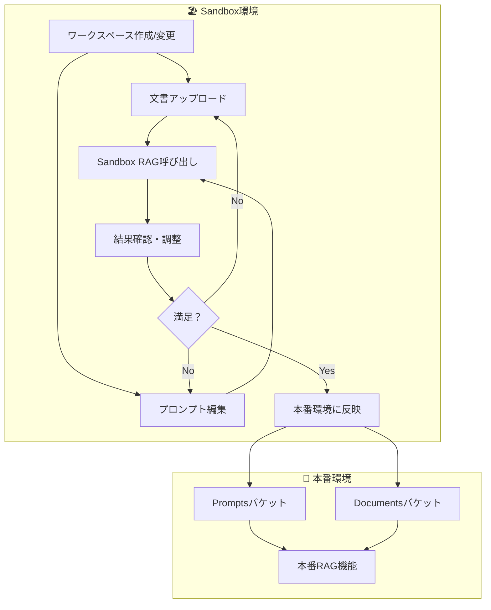
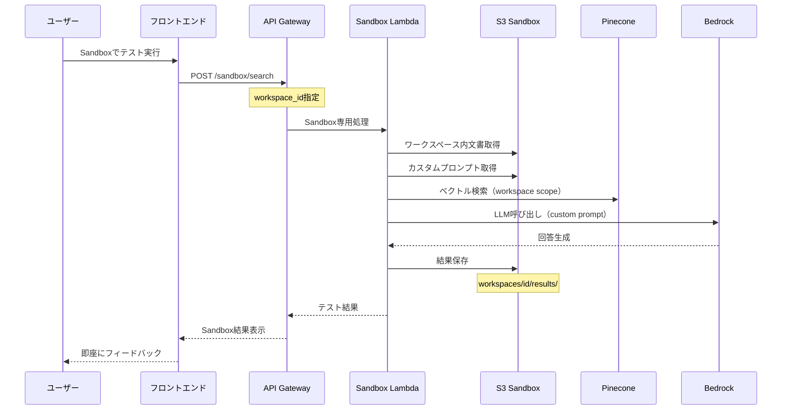
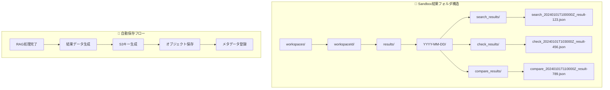
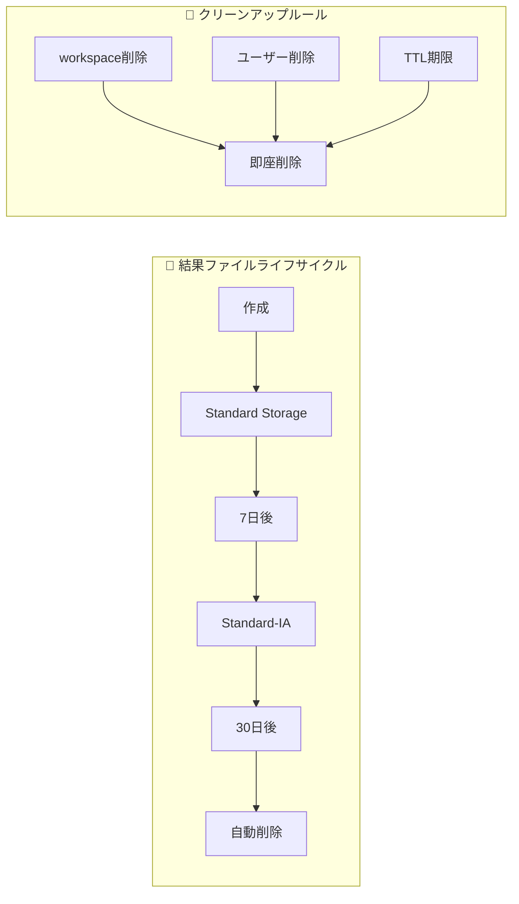
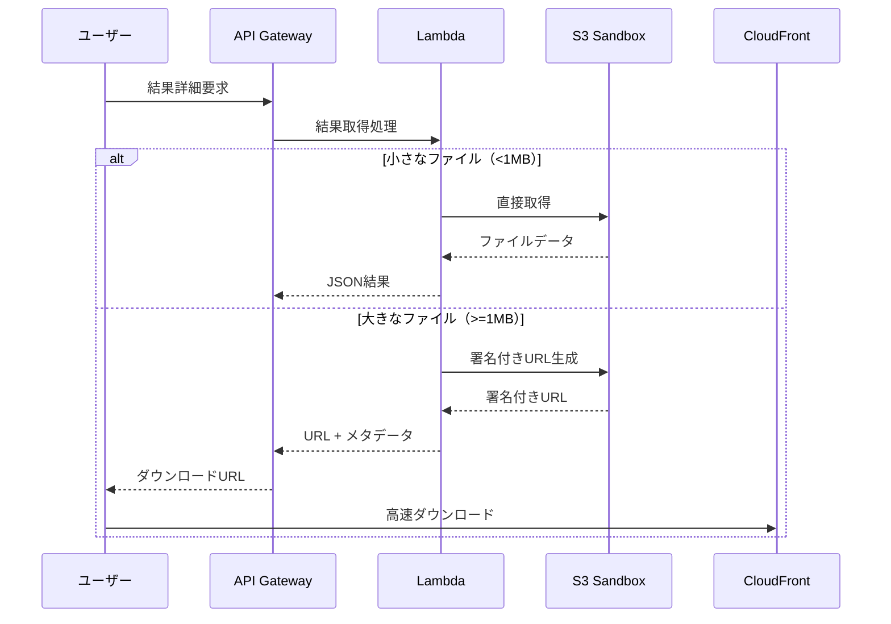

# S3 設計書

## 概要

Advanced RAGシステムにおけるAmazon S3の設計定義書です。文書の原本保管、プロンプト管理、サンドボックス環境での動的フォルダ管理を行います。

## バケット一覧

1. [Documents バケット](#1-documents-バケット) - 文書原本保管
2. [Prompts バケット](#2-prompts-バケット) - プロンプト管理
3. [Sandbox バケット](#3-sandbox-バケット) - サンドボックス環境
4. [Temporary バケット](#4-temporary-バケット) - 一時ファイル保管

## 1. Documents バケット

### 概要
アップロードされた文書の原本を保管し、ダウンロード可能にする

### バケット名
- **開発環境**: `advanced-rag-documents-dev`
- **ステージング環境**: `advanced-rag-documents-staging`
- **本番環境**: `advanced-rag-documents-prod`

### フォルダ構造
```
advanced-rag-documents-{env}/
├── legal/                    # 法務文書
│   ├── compliance/          # コンプライアンス関連
│   ├── regulations/         # 法規制関連
│   └── policies/           # ポリシー関連
├── terms/                   # 約款情報
│   ├── life-insurance/     # 生命保険約款
│   ├── property-insurance/ # 損害保険約款
│   └── common/            # 共通約款
├── notation/               # 表記方法
│   ├── style-guides/      # 表記ガイドライン
│   └── dictionaries/      # 用語辞書（CSV）
├── general/               # 一般文書
│   ├── manuals/          # マニュアル
│   ├── faqs/             # FAQ
│   └── others/           # その他
└── uploads/              # ユーザーアップロード（一時保管）
    └── {userId}/         # ユーザー別フォルダ
        └── {uploadDate}/ # 日付別フォルダ
```

### オブジェクトキー命名規則
```
{category}/{subcategory}/{documentId}_{timestamp}_{fileName}
```

#### 例
```
legal/compliance/doc-123e4567-e89b-12d3-a456-426614174000_20241201T100000Z_compliance_guide.pdf
terms/life-insurance/doc-789a1234-b56c-78d9-e012-345678901234_20241201T100000Z_life_policy.pdf
notation/dictionaries/doc-456b7890-c12d-34e5-f678-901234567890_20241201T100000Z_notation_rules.csv
```

### セキュリティ設定
- **暗号化**: S3 Server-Side Encryption (SSE-S3)
- **アクセス制御**: 
  - IAMロールベースアクセス
  - バケットポリシーによる制限
  - プライベートバケット（パブリックアクセス禁止）
- **バージョニング**: 有効（誤削除防止）
- **MFA Delete**: 本番環境で有効

### ライフサイクル設定
| ストレージクラス | 期間 | 対象 |
|-----------------|------|------|
| Standard | 30日 | 新規アップロード |
| Standard-IA | 90日 | アクセス頻度低下 |
| Glacier Flexible Retrieval | 365日 | 長期保管 |
| Glacier Deep Archive | 無期限 | アーカイブ（削除は明示的指示のみ） |

## 2. Prompts バケット

### 概要
プロンプトの作成・編集機能をサポートするバケット（DynamoDBとの併用）

### バケット名
- **開発環境**: `advanced-rag-prompts-dev`
- **ステージング環境**: `advanced-rag-prompts-staging`
- **本番環境**: `advanced-rag-prompts-prod`

### フォルダ構造
```
advanced-rag-prompts-{env}/
├── system/                  # システムプロンプト
│   ├── search/             # 文書検索用
│   ├── compliance/         # コンプライアンスチェック用
│   ├── terms/              # 約款チェック用
│   └── notation/           # 表記チェック用
├── user/                   # ユーザー定義プロンプト
│   └── {userId}/          # ユーザー別フォルダ
└── templates/              # プロンプトテンプレート
    ├── search/
    ├── compliance/
    ├── terms/
    └── notation/
```

### オブジェクトキー命名規則
```
{type}/{category}/{promptKey}_v{version}.json
```

#### 例
```
system/search/basic_search_v1.json
system/compliance/financial_compliance_v3.json
user/user-123/custom_search_v2.json
templates/search/template_basic_v1.json
```

### データ形式
```json
{
  "promptKey": "basic_search",
  "version": 1,
  "name": "基本検索プロンプト",
  "description": "文書検索用の基本プロンプト",
  "category": "search",
  "content": "あなたは専門的な文書検索アシスタントです...",
  "metadata": {
    "createdBy": "system",
    "createdAt": "2024-12-01T10:00:00Z",
    "tags": ["search", "basic", "general"]
  }
}
```

## 3. Sandbox バケット

### 概要
サンドボックス環境での動的フォルダ管理とテスト用文書保管

### バケット名
- **開発環境**: `advanced-rag-sandbox-dev`
- **ステージング環境**: `advanced-rag-sandbox-staging`
- **本番環境**: `advanced-rag-sandbox-prod`

### フォルダ構造
```
advanced-rag-sandbox-{env}/
├── workspaces/              # ワークスペース
│   └── {workspaceId}/      # 動的に作成されるワークスペース
│       ├── documents/      # テスト文書
│       ├── prompts/        # カスタムプロンプト
│       └── results/        # 処理結果
├── shared/                 # 共有リソース
│   ├── sample-documents/   # サンプル文書
│   └── sample-prompts/     # サンプルプロンプト
└── experiments/            # 実験用領域
    └── {experimentId}/     # 実験別フォルダ
```

### RAG機能統合

#### 概要
Sandbox環境では、動的に変更したプロンプトや文書を即座にテストできるRAG機能統合が必要です。本番環境に影響を与えることなく、安全で効率的な検証・改善サイクルを実現します。

#### Sandbox専用RAG処理フロー



#### 追加APIエンドポイント

##### Sandbox専用検索API
```typescript
// POST /sandbox/search
interface SandboxSearchRequest {
  workspace_id: string;
  query: string;
  search_strategy: 'vector' | 'keyword' | 'hybrid';
  folders: string[]; // ["workspaces/workspace-123/documents"]
  custom_prompt?: string; // ワークスペース内カスタムプロンプト
  search_scope: 'workspace' | 'global' | 'mixed';
}
```

##### Sandbox専用チェックAPI
```typescript
// POST /sandbox/check
interface SandboxCheckRequest {
  workspace_id: string;
  check_type: 'compliance' | 'term' | 'expression';
  document: string;
  custom_prompt: string; // workspaces/{id}/prompts/custom_compliance.json
  search_scope: 'workspace' | 'global';
}
```

##### A/Bテスト機能
```typescript
// POST /sandbox/compare
interface SandboxCompareRequest {
  workspace_id: string;
  test_configs: Array<{
    name: string;
    prompt: string;
    documents: string[];
  }>;
  query: string;
}
```

#### ワークスペース内RAG処理シーケンス



### 動的フォルダ管理
#### フォルダ名変更API例
```typescript
interface FolderRenameRequest {
  workspaceId: string;
  oldFolderName: string;
  newFolderName: string;
  userId: string;
}

// S3オブジェクトのコピー＆削除による実装
async function renameFolder(request: FolderRenameRequest) {
  const oldPrefix = `workspaces/${request.workspaceId}/${request.oldFolderName}/`;
  const newPrefix = `workspaces/${request.workspaceId}/${request.newFolderName}/`;
  
  // 対象オブジェクト一覧取得
  const objects = await s3.listObjectsV2({
    Bucket: bucketName,
    Prefix: oldPrefix
  }).promise();
  
  // 新しいキーにコピー
  for (const obj of objects.Contents) {
    const newKey = obj.Key.replace(oldPrefix, newPrefix);
    await s3.copyObject({
      Bucket: bucketName,
      CopySource: `${bucketName}/${obj.Key}`,
      Key: newKey
    }).promise();
  }
  
  // 古いオブジェクト削除
  await s3.deleteObjects({
    Bucket: bucketName,
    Delete: {
      Objects: objects.Contents.map(obj => ({ Key: obj.Key }))
    }
  }).promise();
}
```

### Sandbox結果保存管理

#### 概要
Sandbox環境での処理結果を効率的に保存・管理するためのS3設計。動的フォルダ構造と自動ライフサイクル管理により、ユーザビリティとコスト最適化を両立します。

#### 結果保存パターン



#### ファイル命名規則

```typescript
interface SandboxResultNaming {
  // 基本パターン
  basePath: 'workspaces/{workspaceId}/results/';
  dateFolder: '{YYYY-MM-DD}/';
  typeFolder: '{resultType}_results/';
  fileName: '{resultType}_{timestamp}_{resultId}.json';
  
  // 具体例
  examples: [
    'workspaces/workspace-123/results/2024-01-01/search_results/search_20240101T100000Z_result-789c0123.json',
    'workspaces/workspace-123/results/2024-01-01/check_results/check_20240101T103000Z_result-456d7890.json',
    'workspaces/workspace-123/results/2024-01-01/compare_results/compare_20240101T110000Z_result-abc12345.json'
  ];
}
```

#### 結果データ形式

```typescript
// 検索結果の保存形式
interface SearchResultFile {
  metadata: {
    resultId: string;
    workspaceId: string;
    resultType: 'search';
    timestamp: string;
    processingTimeMs: number;
    userEvaluation?: 'good' | 'poor' | 'needs_improvement';
  };
  query: {
    text: string;
    strategy: 'vector' | 'keyword' | 'hybrid';
    searchScope: 'workspace' | 'global' | 'mixed';
    customPrompt?: string;
  };
  results: {
    documents: Array<{
      documentId: string;
      title: string;
      content: string;
      score: number;
      metadata: any;
    }>;
    totalResults: number;
    searchMetadata: {
      strategyUsed: string;
      totalDocumentsSearched: number;
    };
  };
}

// チェック結果の保存形式
interface CheckResultFile {
  metadata: {
    resultId: string;
    workspaceId: string;
    resultType: 'check';
    checkType: 'compliance' | 'term' | 'expression';
    timestamp: string;
    processingTimeMs: number;
    userEvaluation?: 'good' | 'poor' | 'needs_improvement';
  };
  input: {
    document: string;
    customPrompt: string;
  };
  results: {
    checkPoints: Array<{
      severity: 'high' | 'medium' | 'low';
      location: string;
      issue: string;
      referenceDocuments: string[];
      referenceContent: string;
    }>;
    summary: {
      totalIssues: number;
      highSeverity: number;
      mediumSeverity: number;
      lowSeverity: number;
    };
  };
}
```

#### ライフサイクル管理



#### オブジェクトメタデータ

```typescript
// S3オブジェクトメタデータ
interface S3ObjectMetadata {
  'x-amz-meta-workspace-id': string;
  'x-amz-meta-result-type': 'search' | 'check' | 'compare';
  'x-amz-meta-user-id': string;
  'x-amz-meta-created-at': string; // ISO timestamp
  'x-amz-meta-expires-at': string; // TTL timestamp
  'x-amz-meta-user-evaluation'?: 'good' | 'poor' | 'needs_improvement';
  'x-amz-meta-processing-time': string; // milliseconds
}
```

#### 大容量結果対応

```typescript
// 大きな結果ファイルの分割保存
interface LargeResultHandling {
  // メイン結果ファイル（概要のみ）
  main: '{resultType}_{timestamp}_{resultId}_summary.json';
  
  // 詳細データファイル（分割）
  details: [
    '{resultType}_{timestamp}_{resultId}_details_part1.json',
    '{resultType}_{timestamp}_{resultId}_details_part2.json'
  ];
  
  // 分割閾値
  splitThreshold: '5MB'; // 5MBを超える場合は分割
}
```

#### 結果取得最適化



## 4. Temporary バケット

### 概要
一時ファイルと処理中ファイルの保管

### バケット名
- **開発環境**: `advanced-rag-temporary-dev`
- **ステージング環境**: `advanced-rag-temporary-staging`
- **本番環境**: `advanced-rag-temporary-prod`

### フォルダ構造
```
advanced-rag-temporary-{env}/
├── uploads/                # アップロード一時保管
│   └── {userId}/          # ユーザー別
│       └── {sessionId}/   # セッション別
├── processing/            # 処理中ファイル
│   └── {executionId}/    # Step Function実行ID別
└── chunks/               # チャンキング結果
    └── {documentId}/     # 文書ID別
```

### ライフサイクル設定
| オブジェクト | 保持期間 | 削除方法 |
|-------------|----------|----------|
| uploads/ | 24時間 | 自動削除 |
| processing/ | 7日間 | 自動削除 |
| chunks/ | 30日間 | 自動削除 |

## アクセスパターン

### 1. 文書アップロード
```typescript
// 1. Temporaryバケットに一時保存
const tempKey = `uploads/${userId}/${sessionId}/${fileName}`;
await s3.putObject({
  Bucket: temporaryBucket,
  Key: tempKey,
  Body: fileBuffer
}).promise();

// 2. 処理後、Documentsバケットに移動
const finalKey = `${category}/${subcategory}/${documentId}_${timestamp}_${fileName}`;
await s3.copyObject({
  Bucket: documentsBucket,
  CopySource: `${temporaryBucket}/${tempKey}`,
  Key: finalKey
}).promise();

// 3. DynamoDBにメタデータ登録
await dynamodb.putItem({
  TableName: 'Documents',
  Item: {
    documentId,
    s3Bucket: documentsBucket,
    s3Key: finalKey,
    // その他メタデータ
  }
}).promise();
```

### 2. 文書ダウンロード
```typescript
// DynamoDBからS3情報取得
const document = await dynamodb.getItem({
  TableName: 'Documents',
  Key: { documentId }
}).promise();

// S3から文書取得
const signedUrl = s3.getSignedUrl('getObject', {
  Bucket: document.Item.s3Bucket.S,
  Key: document.Item.s3Key.S,
  Expires: 3600 // 1時間有効
});
```

### 3. プロンプト管理
```typescript
// プロンプト保存（S3 + DynamoDB）
const promptKey = `system/search/${promptId}_v${version}.json`;
await s3.putObject({
  Bucket: promptsBucket,
  Key: promptKey,
  Body: JSON.stringify(promptData),
  ContentType: 'application/json'
}).promise();

// DynamoDBにインデックス情報保存
await dynamodb.putItem({
  TableName: 'Prompts',
  Item: {
    promptKey: promptId,
    version,
    s3Bucket: promptsBucket,
    s3Key: promptKey,
    // その他メタデータ
  }
}).promise();
```

## 監視・ログ

### CloudWatch メトリクス
- **リクエストメトリクス**: PUT/GET/DELETE操作数
- **ストレージメトリクス**: バケットサイズ、オブジェクト数
- **エラーメトリクス**: 4xx/5xxエラー率
- **パフォーマンス**: レスポンス時間

### CloudTrail
- **API操作ログ**: すべてのS3 API呼び出し
- **アクセスログ**: オブジェクトアクセス履歴
- **データイベント**: オブジェクトレベルの操作

### アラート設定
- **高エラー率**: 5%以上の4xx/5xxエラー
- **異常なアクセス**: 通常の10倍以上のリクエスト
- **ストレージ容量**: 使用量が80%を超過
- **コスト**: 月間コストが予算の90%を超過

## セキュリティ設定

### バケットポリシー例
```json
{
  "Version": "2012-10-17",
  "Statement": [
    {
      "Sid": "DenyPublicAccess",
      "Effect": "Deny",
      "Principal": "*",
      "Action": "s3:*",
      "Resource": [
        "arn:aws:s3:::advanced-rag-documents-prod",
        "arn:aws:s3:::advanced-rag-documents-prod/*"
      ],
      "Condition": {
        "StringNotEquals": {
          "aws:PrincipalServiceName": [
            "lambda.amazonaws.com"
          ]
        }
      }
    }
  ]
}
```

### IAMロール例
```json
{
  "Version": "2012-10-17",
  "Statement": [
    {
      "Effect": "Allow",
      "Action": [
        "s3:GetObject",
        "s3:PutObject",
        "s3:DeleteObject"
      ],
      "Resource": [
        "arn:aws:s3:::advanced-rag-documents-prod/*",
        "arn:aws:s3:::advanced-rag-temporary-prod/*"
      ]
    }
  ]
}
```

## コスト最適化

### ストレージクラス最適化
- **Intelligent-Tiering**: アクセスパターンが不明な文書
- **Standard-IA**: 30日以降のアクセス頻度低下文書
- **Glacier**: 長期保管必須文書

### リクエスト最適化
- **Transfer Acceleration**: 大きなファイルのアップロード
- **Multipart Upload**: 100MB以上のファイル
- **S3 Batch Operations**: 大量ファイルの一括操作

### モニタリング
- **Cost Explorer**: ストレージクラス別コスト分析
- **S3 Storage Lens**: 使用パターン分析
- **予算アラート**: 月間コスト制限