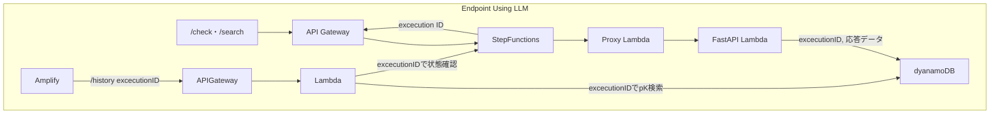
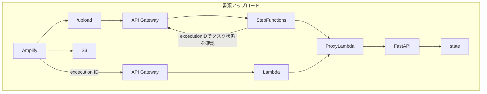

```mermaid
graph TB
subgraph "Endpoint Using LLM"
A["/check・/search"] --> E["API Gateway"] -->H["StepFunctions"]--> B["Proxy Lambda"] --> C[" FastAPI Lambda"] -->|excecutionID, 応答データ| D["dyanamoDB"]
H -->|excecution ID| E
F["Amplify"]-->|/history excecutionID|R[APIGateway]-->G["Lambda"]-->|excecutionIDでpK検索|D["dyanamoDB"]
G-->|excecutionIDで状態確認|H
end
```

```mermaid
graph TB
subgraph "書類アップロード"
I["Amplify"]-->J["/upload"]
J--> Q["API Gateway"]
I --> K["S3"]
Q-->M["StepFunctions"]
M-->L["ProxyLambda"]
L-->N["FastAPI"]
N-->O["state"]
I-->|excecution ID|R[API Gateway]-->P["Lambda"]-->L
M-->|excecutionIDでタスク状態を確認|Q
end
```