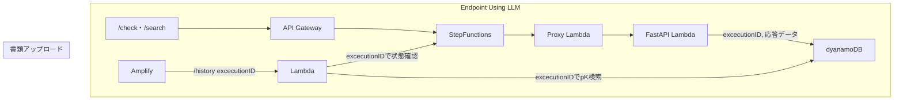

```mermaid
graph TB
subgraph "Endpoint Using LLM"
A["/check・/search"] --> E["API Gateway"] -->H["StepFunctions"]--> B["Proxy Lambda"] --> C[" FastAPI Lambda"] -->|excecutionID, 応答データ| D["dyanamoDB"]
F["Amplify"]-->|/history excecutionID|G["Lambda"]-->|excecutionIDでpK検索|D["dyanamoDB"]
G-->|excecutionIDで状態確認|H
end

subgraph "書類アップロード"
end
```