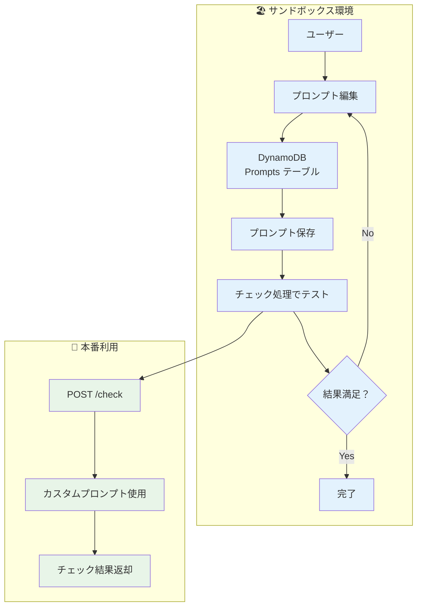

# バックエンドサービス要件定義書

## 1. 目的

Advanced RAGシステムのバックエンドAPIサービスを構築し、文書検索、コンプライアンスチェック、約款チェック、表記チェック機能を提供する。フロントエンドアプリケーションとの疎結合な設計により、独立した開発・デプロイを可能にする。

## 2. 本要件定義書の範囲

本要件定義書は、Advanced RAGシステムのバックエンドAPIサービスの機能要件、非機能要件、技術仕様、インフラ構成を定義する。

## 3. 機能要件

### 3.1 Advanced RAG の手続き構成

#### 3.1.1 検索・チェック機能

- **文書検索**
  - 概要：指定されたクエリに対して関連文書を検索・取得
  - 検索対象：アップロードされた全ての文書
  - 検索戦略：ベクトル検索、キーワード検索、ハイブリッド検索
  - フォルダ指定検索：特定フォルダ内の文書に限定した検索

- **コンプライアンスチェック**
  - 概要：与えられた文章が金融法などの関連法律に違反した書き方をしていないかをチェック
  - 検索対象：法務文書（legal/compliance, legal/regulations, legal/policies）
  - 処理方式：同期処理（即座にチェック結果を返す）

- **約款チェック**
  - 概要：与えられた文章が約款情報に違反/矛盾した内容がないかを検査
  - 検索対象：約款情報を含むドキュメント（terms/life-insurance, terms/property-insurance, terms/common）
  - 処理方式：同期処理（即座にチェック結果を返す）

- **表記チェック**
  - 概要：与えられた文書が正しい表記法を使用しているかをチェック
  - 検索対象：表記方法をまとめたCSVファイル（notation/style-guides, notation/dictionaries）
  - 処理方式：同期処理（即座にチェック結果を返す）

#### 3.1.2 簡素化されたチェック処理フロー


#### 3.1.3 RAG処理パイプライン

- **Pre-Retrieval処理**
  - 検索クエリの生成・拡張
  - リクエスト文書の分割・前処理

- **検索戦略**
  - ベクトル検索（セマンティック検索）
  - キーワード検索（BM25）
  - ハイブリッド検索（ベクトル + キーワード）

- **Post-Retrieval処理**
  - リランキング（関連度による再順序付け）
  - メタデータ圧縮
  - RAG Fusion処理

- **回答生成**
  - 検索結果に基づく回答生成
  - コンテキスト管理
  - チャット履歴の考慮

#### 3.1.3 チャット機能

- セッション管理（30日間保持）
- 会話履歴の保持
- コンテキストの継続

### 3.2 ドキュメント管理機能

#### 3.2.1 ドキュメントアップロード・埋め込み

- **対応ドキュメント形式**
  - PDF
  - CSV
  - その他テキストファイル

- **チャンキング戦略**
  - 文字数ベースのチャンキング
  - セマンティックチャンキング
  - 文書構造を考慮したチャンキング

- **ベクトルデータベース**
  - Pinecone（全環境統一）
    - 開発環境：独立したインデックス
    - ステージング環境：独立したインデックス
    - 本番環境：独立したインデックス

- **文書保管・管理**
  - 文書の原本：S3に保管、ダウンロード可能
  - 文書の目録と保管先：DynamoDBに登録
  - 文書のメタデータ管理

#### 3.2.2 S3ストレージ構成

- **Documents バケット**: 文書原本保管
  - legal/: 法務文書（compliance, regulations, policies）
  - terms/: 約款情報（life-insurance, property-insurance, common）
  - notation/: 表記方法（style-guides, dictionaries）
  - general/: 一般文書（manuals, faqs, others）
  - uploads/: ユーザーアップロード（一時保管）

- **Temporary バケット**: 一時ファイル保管
  - uploads/: アップロード一時保管（24時間）
  - processing/: 処理中ファイル（7日間）
  - chunks/: チャンキング結果（30日間）

- **Prompts バケット**: プロンプト管理（オプション、DynamoDBのみでも可）
  - system/: システムプロンプト
  - user/: ユーザー定義プロンプト

#### 3.2.3 DynamoDBテーブル構成

- **Documents テーブル**: 文書管理
  - Primary Key: documentId
  - GSI: category-uploadedAt-index, uploadedBy-uploadedAt-index
  
- **ChatSessions テーブル**: チャットセッション管理
  - Primary Key: sessionId, Sort Key: messageIndex
  - GSI: userId-timestamp-index
  - TTL: 30日間

- **ProcessingHistory テーブル**: 処理履歴管理
  - Primary Key: executionId
  - GSI: userId-createdAt-index, queryType-createdAt-index
  - TTL: 2年間（Bedrock履歴）

- **Prompts テーブル**: プロンプト管理
  - Primary Key: promptKey, Sort Key: version
  - GSI: category-isActive-index

- **UserSessions テーブル**: ユーザーセッション管理
  - Primary Key: userId, Sort Key: sessionId
  - GSI: sessionId-index
  - TTL: 30日間

### 3.3 履歴管理機能

#### 3.3.1 回答履歴の参照

- Step Function タスク完了時にレスポンス結果をDynamoDBに登録
- 検索履歴の保存・参照
- ユーザー別履歴管理
- 将来的にAppSync (GraphQL)でアクセス可能にする予定

### 3.4 API設計

- RESTful API設計
- OpenAPI仕様書の提供
- バージョニング対応（URL パスによる）
- プロンプトはフロントで指定し、指定されたプロンプトを使用する
- JWT Bearer Token認証（Cognito）

#### 3.4.1 主要APIエンドポイント

- **ヘルスチェック系**: `/health`, `/rag/health`
- **文書検索系**: `POST /search` ※Step Functions非同期処理
- **チェック系**: `POST /check` ※Step Functions非同期処理
- **文書管理系**: `POST /upload` ※Step Functions非同期処理, `GET /download`, `GET /documents`, `DELETE /documents/{id}`
- **実行状態管理**: `GET /execution/{executionId}/status`, `GET /execution/{executionId}/result`
- **サンドボックス管理**: `GET /sandbox/prompts`, `GET /sandbox/prompts/{id}`, `POST /sandbox/prompts`, `PUT /sandbox/prompts/{id}`
- **履歴管理**: `GET /history/search`, `GET /history/checks`

#### 3.4.2 Step Functions対応APIの動作

**非同期処理API** (`POST /search`, `POST /check`, `POST /upload`)
1. **即座レスポンス**: `{"executionId": "xxx", "status": "RUNNING"}`
2. **ポーリング**: `GET /execution/{executionId}/status`
3. **結果取得**: `GET /execution/{executionId}/result`（完了後）

**ポーリングレスポンス例**:
```json
{
  "executionId": "uuid-string",
  "status": "RUNNING|SUCCEEDED|FAILED",
  "startTime": "2024-01-01T00:00:00Z",
  "endTime": "2024-01-01T00:01:30Z",
  "result": { /* 完了時のみ */ },
  "error": { /* エラー時のみ */ }
}
```

### 3.5 サンドボックス環境

#### 3.5.1 プロンプト編集機能

- **概要**: フロントエンドからプロンプト内容を編集・保存する機能
- **データ管理**: DynamoDB Prompts テーブルで管理
- **機能**: 
  - プロンプト一覧取得
  - プロンプト内容取得
  - プロンプト作成・更新
- **用途**: チェック処理で使用するプロンプトのカスタマイズ

#### 3.5.2 簡素化されたサンドボックス機能フロー




### 3.6 ユーザー権限

- Cognito による認証・認可
- ユーザー別リソースアクセス制御

## 4. 非機能要件

### 4.1 性能要件

- **レスポンスタイム**
  - **即座レスポンス**: API起動からexecutionId返却まで 3秒以内
  - **非同期処理時間**:
    - 文書検索：15秒以内
    - チェック機能：10秒以内（Step Functions経由）
    - ファイルアップロード：120秒以内
  - **ポーリング間隔**: 1-5秒（推奨）

- **制限事項**
  - ファイルサイズ：最大 10MB
  - API呼び出し制限：ユーザーあたり 1000 リクエスト/時間
  - Lambda同時実行数：1000 同時実行
  - Step Functions同時実行数：100 同時実行
  - ポーリング頻度制限：1リクエスト/秒（同一executionId）

### 4.2 セキュリティ要件

#### 4.2.1 認証・認可

- **Cognito による認証**
  - JWT トークンベース認証
  - ユーザープール管理
  - API Gateway Cognito Authorizer

#### 4.2.2 データ保護

- **転送時暗号化**
  - TLS 1.2以上
  - HTTPS必須

- **保存時暗号化**
  - S3: Server-Side Encryption (SSE-S3)
  - DynamoDB: 保存時暗号化
  - Secrets Manager: キー管理

#### 4.2.3 アクセス制御

- **S3セキュリティ設定**
  - IAMロールベースアクセス
  - バケットポリシーによる制限
  - プライベートバケット（パブリックアクセス禁止）
  - バージョニング有効（誤削除防止）
  - MFA Delete（本番環境）

- **DynamoDB セキュリティ**
  - IAMロールベースアクセス
  - リソースレベル権限制御

- **Lambda セキュリティ**
  - 最小権限の原則
  - VPC内実行（必要に応じて）

### 4.3 可用性要件

- **ヘルスチェック**: 定期的な生存確認

### 4.4 運用・監視

#### 4.4.1 ログ管理

- **CloudWatch Logs**
  - 構造化ログ
  - エラー追跡
  - アクセスログ

- **ログ保持期間**
  - API Gateway アクセスログ: 1年間
  - Lambda実行ログ: 1年間
  - Step Function実行ログ: 1年間

#### 4.4.2 監視・アラート

- **メトリクス監視**
  - API Gateway: リクエスト数、エラー率、レイテンシ
  - Lambda: 実行時間、エラー数、同時実行数
  - DynamoDB: 読み書きキャパシティ、スロットリング
  - S3: リクエスト数、エラー率、ストレージ使用量

- **ヘルスチェック**
  - システム全体の死活監視
  - 外部サービス（Pinecone、Bedrock）の接続確認

- **異常検知・アラート**
  - エラー率閾値超過
  - レスポンス時間劣化
  - リソース使用量異常

### 4.5 アーキテクチャ設計

- **疎結合設計**
  - API Gateway による独立した実装
  - マイクロサービスアーキテクチャ
  - イベント駆動アーキテクチャ

- **スケーラビリティ**
  - サーバーレスアーキテクチャ
  - 自動スケーリング対応

## 5. データ保持・削除ポリシー

### 5.1 データ保持期間

- **ドキュメント原本**: 無期限保持（削除は明示的な指示のみ）
- **ベクトルデータ**: ドキュメント削除まで保持
- **チャットセッション**: 30日間保持（TTL自動削除）
- **処理履歴（Bedrockの履歴）**: 2年間保持（TTL自動削除）
- **ユーザーセッション**: 30日間保持（TTL自動削除）
- **ログデータ**: 1年間保持
- **一時ファイル**: 24時間後自動削除（S3ライフサイクル）
- **処理中ファイル**: 7日間後自動削除（S3ライフサイクル）
- **チャンキング結果**: 30日間後自動削除（S3ライフサイクル）

### 5.2 データ削除ポリシー

- **手動削除**: AWSコンソールを通じて該当のデータなどは削除
- **自動削除**: 
  - DynamoDB TTL設定による自動削除
  - S3ライフサイクルポリシーによる自動削除
- **Bedrockの履歴**: ライフサイクルを設定し、自動で削除されるように設定

### 5.3 S3ライフサイクル設定

| ストレージクラス | 期間 | 対象 |
|-----------------|------|------|
| Standard | 30日 | 新規アップロード |
| Standard-IA | 90日 | アクセス頻度低下 |
| Glacier Flexible Retrieval | 365日 | 長期保管 |
| Glacier Deep Archive | 無期限 | アーカイブ（削除は明示的指示のみ） |

## 6. インフラ構成

### 6.1 AWS サービス構成

- **API Gateway**: RESTful APIエンドポイント
- **Lambda**: サーバーレス実行環境
- **Step Functions**: ワークフロー管理（非同期処理・ポーリング機能）
- **ECR**: Dockerイメージ管理
- **DynamoDB**: NoSQLデータベース
- **S3**: オブジェクトストレージ（4バケット構成）
- **Bedrock**: LLMサービス
  - **ナレッジベース**: Pineconeへのアクセス
  - **Embedding生成**: テキストベクトル化
- **Pinecone**: Vector Database（全環境統一）
- **Cognito**: 認証サービス
- **Secrets Manager**: キー管理
- **CloudWatch**: ログ管理・監視

### 6.1.1 Step Functionsによる非同期処理アーキテクチャ

FastAPIの時間がかかる処理（RAGによるサーチ、チェック、ファイルのアップロード）は、**Step Functionsを用いたポーリング方式**で実装されます。

#### アーキテクチャフロー
1. **API Gateway** → **Lambda（Step Functions起動）** → **Step Functions** → **プロキシLambda** → **FastAPI**

#### 構成要素
- **API Gateway**: フロントエンドからのAPIリクエストを受信
- **Step Functions起動Lambda**: Step Functionsワークフローを開始し、実行IDをレスポンス
- **Step Functions**: 非同期処理のワークフローを管理・実行
- **プロキシLambda**: Step FunctionsとFastAPIの間でデータ整形・プロキシ処理
- **FastAPI Lambda**: 実際のRAG処理、チェック処理、ファイル処理を実行

#### ポーリング処理フロー


#### 利点
- **レスポンシブ性**: 長時間処理でもフロントエンドがブロックされない
- **透明性**: 実行状態をリアルタイムで追跡可能
- **エラーハンドリング**: Step Functionsによる堅牢な例外処理・リトライ機能
- **スケーラビリティ**: 複数の長時間処理を並行実行可能

### 6.2 AWS アーキテクチャ構成図

Step Functionsによる非同期処理フロー: **API Gateway → Lambda（SF起動）→ Step Functions → プロキシLambda → FastAPI**

```mermaid
graph TB
    subgraph "Frontend"
        FE[React/Amplify Frontend]
    end
    
    subgraph "Authentication"
        COGNITO[Amazon Cognito<br/>User Pool]
    end
    
    subgraph "API Layer"
        APIGW[API Gateway<br/>REST API]
        AUTH[Cognito Authorizer]
    end
    
    subgraph "Compute Layer"
        INVOKE_LAMBDA[Step Functions起動Lambda<br/>実行ID即座返却]
        ECR[Amazon ECR<br/>Docker Images]
    end
    
    subgraph "Orchestration Layer"
        SF[Step Functions<br/>非同期ワークフロー管理]
        PROXY_LAMBDA[プロキシLambda<br/>データ整形・転送]
        FASTAPI_LAMBDA[FastAPI Lambda<br/>RAG/チェック/アップロード処理]
    end
    
    subgraph "Storage"
        S3_DOC[S3 Documents Bucket<br/>文書原本保管]
        S3_TEMP[S3 Temporary Bucket<br/>一時ファイル保管]
        S3_PROMPT[S3 Prompts Bucket<br/>プロンプト管理（オプション）]
    end
    
    subgraph "Database"
        DDB_DOCS[DynamoDB Documents<br/>文書メタデータ]
        DDB_CHAT[DynamoDB ChatSessions<br/>チャット履歴]
        DDB_HISTORY[DynamoDB ProcessingHistory<br/>処理履歴]
        DDB_PROMPTS[DynamoDB Prompts<br/>プロンプト管理]
        DDB_SESSIONS[DynamoDB UserSessions<br/>ユーザーセッション]
        DDB_EXECUTION[DynamoDB ExecutionStatus<br/>実行状態管理]
    end
    
    subgraph "AI/ML Services"
        BEDROCK[Amazon Bedrock<br/>LLM & Embedding]
        PINECONE[Pinecone<br/>Vector Database]
    end
    
    subgraph "Security"
        SECRETS[AWS Secrets Manager<br/>API Keys管理]
    end
    
    subgraph "Monitoring"
        CW[CloudWatch<br/>Logs & Metrics]
    end
    
    %% Authentication Flow
    FE -->|JWT Token| COGNITO
    COGNITO -->|Authorize| AUTH
    
    %% API Flow - 非同期処理開始
    FE -->|POST /search<br/>/check<br/>/upload| APIGW
    APIGW -->|Authorize| AUTH
    AUTH -->|Execute| INVOKE_LAMBDA
    INVOKE_LAMBDA -->|Start Execution| SF
    INVOKE_LAMBDA -->|即座にレスポンス<br/>executionId| APIGW
    
    %% API Flow - ポーリング
    FE -.->|GET /execution/id/status<br/>ポーリング| APIGW
    APIGW -.->|Status Check| SF
    SF -.->|Status Response| APIGW
    
    %% Step Functions Workflow
    SF -->|Invoke with Data| PROXY_LAMBDA
    PROXY_LAMBDA -->|Format & Forward| FASTAPI_LAMBDA
    FASTAPI_LAMBDA -->|Result| PROXY_LAMBDA
    PROXY_LAMBDA -->|Formatted Result| SF
    SF -->|Store Execution Result| DDB_EXECUTION
    
    %% Container Images
    ECR -->|Images| INVOKE_LAMBDA
    ECR -->|Images| PROXY_LAMBDA
    ECR -->|Images| FASTAPI_LAMBDA
    
    %% Data Storage Access
    FASTAPI_LAMBDA -->|Store/Retrieve| S3_DOC
    FASTAPI_LAMBDA -->|Temp Files| S3_TEMP
    FASTAPI_LAMBDA -->|Prompts| S3_PROMPT
    
    %% Database Operations
    FASTAPI_LAMBDA -->|Metadata| DDB_DOCS
    FASTAPI_LAMBDA -->|Chat Data| DDB_CHAT
    FASTAPI_LAMBDA -->|History| DDB_HISTORY
    FASTAPI_LAMBDA -->|Prompts Meta| DDB_PROMPTS
    FASTAPI_LAMBDA -->|Sessions| DDB_SESSIONS
    
    %% AI/ML Integration
    FASTAPI_LAMBDA -->|LLM Requests| BEDROCK
    FASTAPI_LAMBDA -->|Vector Operations| PINECONE
    
    %% Security
    FASTAPI_LAMBDA -->|API Keys| SECRETS
    
    %% Monitoring
    INVOKE_LAMBDA -->|Logs| CW
    PROXY_LAMBDA -->|Logs| CW
    FASTAPI_LAMBDA -->|Logs| CW
    APIGW -->|Access Logs| CW
    SF -->|Execution Logs| CW
    
    %% S3 Event Triggers
    S3_DOC -->|Object Created| FASTAPI_LAMBDA
    
    %% Data Flow Styling
    classDef frontend fill:#e1f5fe
    classDef api fill:#f3e5f5
    classDef compute fill:#e8f5e8
    classDef orchestration fill:#fff3e0
    classDef storage fill:#fff8e1
    classDef database fill:#fce4ec
    classDef ai fill:#e0f2f1
    classDef security fill:#fff9c4
    classDef monitoring fill:#f1f8e9
    
    class FE frontend
    class COGNITO,AUTH,APIGW api
    class INVOKE_LAMBDA,ECR compute
    class SF,PROXY_LAMBDA,FASTAPI_LAMBDA orchestration
    class S3_DOC,S3_TEMP,S3_PROMPT storage
    class DDB_DOCS,DDB_CHAT,DDB_HISTORY,DDB_PROMPTS,DDB_SESSIONS,DDB_EXECUTION database
    class BEDROCK,PINECONE ai
    class SECRETS security
    class CW monitoring
```



### 6.3 RAG処理フロー図


### 6.4 RAGワークフロー図


### 6.5 開発・運用環境

- **環境分離**: dev, staging, prod
- **CI/CD**: AWS CDK
- **コンテナ化**: Docker
- **Infrastructure as Code**: AWS CDK 2.200.1+

## 7. 技術スタック

### 7.1 Advanced RAG

- **LangChain**: RAGフレームワーク
- **FastAPI**: Webフレームワーク
- **boto3**: AWS SDK
- **Docling**: 文書処理
- **Mangum**: ASGI-Lambda アダプター

### 7.2 開発環境

- **Node.js**: 20+
- **TypeScript**: 5.3.3
- **パッケージマネージャー**: Yarn

### 7.3 開発ツール

- **プロジェクト管理**: Projen 0.77.5
- **バンドラー**: ESBuild 0.19.8
- **コンテナ**: Docker, Docker Compose 3.8

### 7.4 AWS Services

- API Gateway, Lambda, ECR, DynamoDB, S3, Bedrock, Cognito, Secrets Manager, Step Functions, CloudWatch

### 7.5 CI/CD

- **AWS CDK**: Infrastructure as Code

## 8. エラーハンドリング・例外処理

### 8.1 エラー分類

#### 8.1.1 システムエラー（5xx系）

- **500 Internal Server Error**
  - 未処理の例外
  - システム内部エラー
  - 設定エラー

- **502 Bad Gateway**
  - 外部サービス（Bedrock、Pinecone等）の応答エラー
  - Lambda関数のタイムアウト

- **503 Service Unavailable**
  - システムメンテナンス中
  - リソース不足による一時的な利用不可

- **504 Gateway Timeout**
  - Step Function実行タイムアウト
  - 外部API呼び出しタイムアウト
  - プロキシLambda応答タイムアウト

#### 8.1.2 クライアントエラー（4xx系）

- **400 Bad Request**
  - リクエストパラメータ不正
  - JSONフォーマットエラー
  - 必須パラメータ不足

- **401 Unauthorized**
  - 認証トークン不正・期限切れ
  - 認証情報不足

- **403 Forbidden**
  - 権限不足
  - リソースアクセス権限なし

- **404 Not Found**
  - リソースが存在しない
  - エンドポイント不正

- **413 Payload Too Large**
  - ファイルサイズ制限超過（10MB）
  - リクエストサイズ制限超過

- **429 Too Many Requests**
  - API呼び出し制限超過（1000リクエスト/時間）
  - レート制限適用

#### 8.1.3 ビジネスロジックエラー

- **RAG_001**: ドキュメント処理エラー
  - ファイル形式未対応
  - ファイル破損
  - テキスト抽出失敗

- **RAG_002**: 検索処理エラー
  - ベクトルデータベース接続エラー
  - 検索結果0件
  - 検索クエリ不正

- **RAG_003**: 埋め込み生成エラー
  - Embedding API エラー
  - トークン制限超過

- **RAG_004**: 回答生成エラー
  - LLM API エラー
  - コンテキスト長制限超過

- **SF_001**: Step Functions実行エラー
  - ワークフロー定義エラー
  - 状態遷移エラー
  - 実行タイムアウト

- **SF_002**: プロキシLambdaエラー
  - データ整形失敗
  - FastAPI通信エラー
  - レスポンス変換エラー

## 9. 今後の拡張予定

### 9.1 GraphQL API

- AppSync (GraphQL) による検索履歴・処理履歴アクセス機能の追加
- DynamoDBの検索機能拡張
